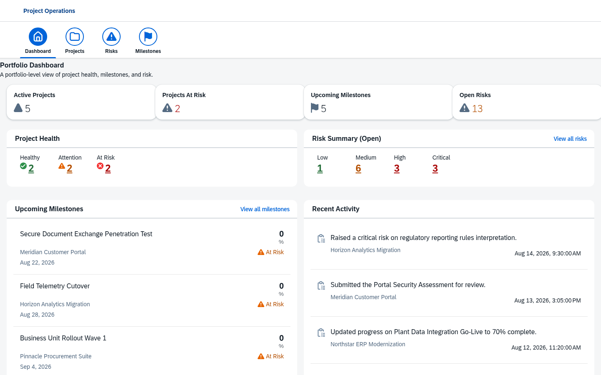
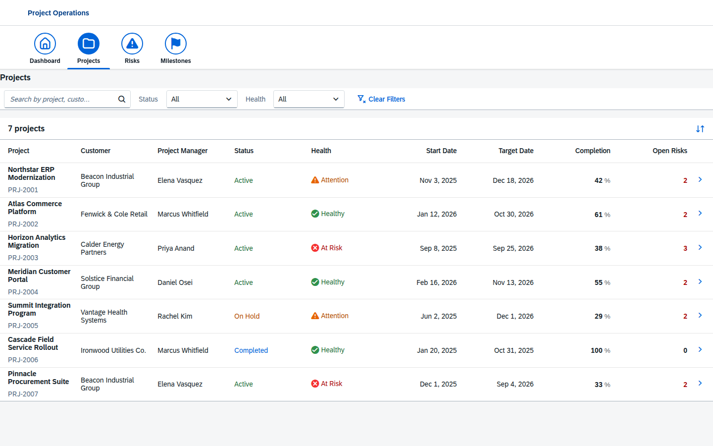
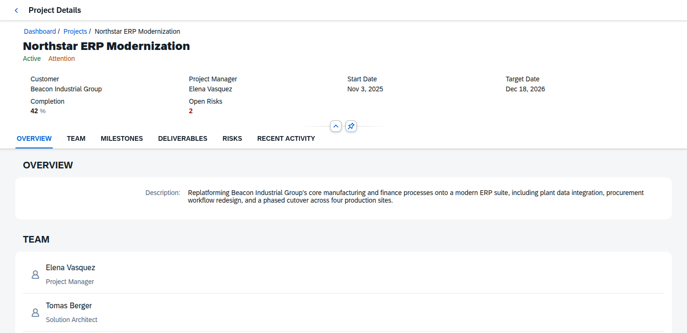
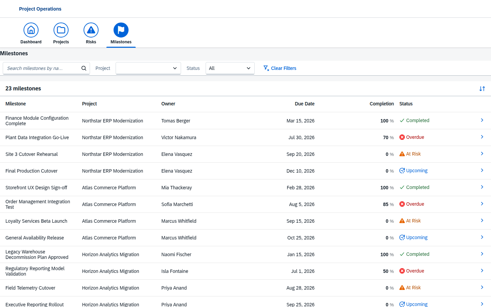
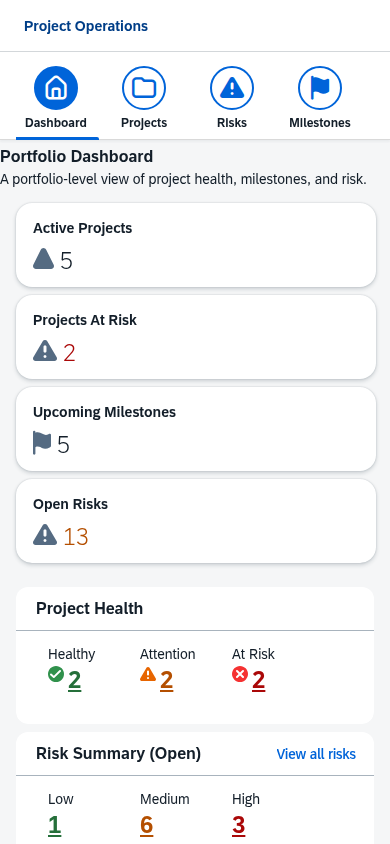

# Project Operations

A portfolio-management web application for a fictional technology consulting organization, built with **OpenUI5** to demonstrate senior-level SAPUI5/Fiori engineering — no SAP BTP, no SAP account, and no real OData backend required.



## Overview

Project Operations gives a consulting delivery organization a portfolio-level view of its engagements: which projects are healthy, which are at risk, what's coming due, and where the open risks are concentrated. It is a **read-oriented operational dashboard** — Dashboard, Projects, Project Detail, Risks, and Milestones — built entirely on public OpenUI5 APIs against a local, fictional dataset.

This is a **greenfield personal portfolio project**. It contains no employer or client code, data, architecture, or intellectual property. See [Data / Privacy](#data--privacy) below.

## Features

- **Portfolio Dashboard** — KPI tiles (Active Projects, Projects At Risk, Upcoming Milestones, Open Risks), a project health breakdown, an open-risk severity summary, upcoming milestones, and recent activity — all computed from the underlying dataset, not hardcoded.
- **Projects** — a responsive, sortable, filterable table of every engagement with semantic status/health indicators (icon + text, never color alone), free-text search, and status/health filters.
- **Project Detail** — an `ObjectPageLayout` per project with Overview, Team, Milestones, Deliverables, Risks, and Recent Activity sections, reached by drill-down navigation (not a primary nav item), with breadcrumbs and a clear back action.
- **Risks** — a portfolio-wide risk register with search and project/severity/status filtering.
- **Milestones** — a cross-project milestone view whose status (Completed / Upcoming / At Risk / Overdue) is *derived* from due dates rather than stored as a separate, potentially contradictory field.
- **Deep-linkable filters** — dashboard KPIs and health/risk tiles navigate into the relevant list pre-filtered, via real router query parameters (shareable/bookmarkable URLs).
- **Professional empty & error states** — no-results, unknown routes, and unknown project IDs all get an `IllustratedMessage`, never a blank screen.
- **Fully responsive** — verified at 1440 / 1024 / 768 / 430 / 390px with no horizontal overflow, using native UI5 responsive patterns (table pop-in, `IconTabHeader` overflow, `ObjectPageLayout` anchor-bar collapse).

| Projects | Project Detail |
| --- | --- |
|  |  |

| Milestones | Dashboard — mobile |
| --- | --- |
|  |  |

## Technology

- **[OpenUI5](https://openui5.org/)** 1.151.0 — `sap.ui.core`, `sap.m`, `sap.f`, `sap.ui.layout`, `sap.uxap`
- **[UI5 Tooling](https://sap.github.io/ui5-tooling/)** (`@ui5/cli`) for the dev server and production build
- XML Views, XML Fragments, and JS controllers (no JSX/React/Vue/Angular)
- `JSONModel` over a local, normalized fictional dataset
- `sap.ui.model.resource.ResourceModel` for i18n
- QUnit for unit tests, ESLint for linting

No SAP BTP account, SAP Business Application Studio, or live OData service is required to run, build, or test this project.

## Architecture

### Current (V1)

```
Browser
   │
OpenUI5 (sap.ui.core / sap.m / sap.f / sap.ui.layout / sap.uxap)
   │
XML Views ──▶ Controllers ──▶ Formatter / PortfolioCalculations / PortfolioRepository (util/)
   │
JSONModel ("portfolio")
   │
Local fictional dataset (webapp/data/*.json)
```

The data-access layer (`util/PortfolioRepository.js`) joins the normalized local JSON collections (`projects`, `customers`, `people`, `milestones`, `deliverables`, `risks`, `activities`) into the denormalized, view-ready shapes the screens bind against — the same shape an OData `$expand` would produce. Business rules (which milestones are overdue, portfolio KPI counts, health/risk summaries) live in `util/PortfolioCalculations.js`, a UI5-control-free module that is unit tested directly. Because views bind against a model built this way rather than against raw JSON, **the `JSONModel` can be swapped for an OData V4 model later without rewriting the views or controllers.**

### Future direction (not implemented in V1 — see [Roadmap](#roadmap))

```
Browser
   │
OpenUI5 / SAPUI5
   │
OData V4
   │
SAP CAP (Node.js)
   │
SQLite (local) / SAP HANA Cloud (BTP)
   │
SAP BTP (Cloud Foundry)
```

## Project Structure

```
webapp/
├── controller/          BaseController + one controller per view
├── view/                XML views (App, Dashboard, Projects, ProjectDetail, Risks, Milestones, NotFound)
├── view/fragment/        Reusable XML fragments (shell header, section nav, sort dialogs)
├── model/                models.js — loads + assembles the local dataset into a JSONModel
├── util/                 Formatter.js, PortfolioCalculations.js, PortfolioRepository.js
├── data/                 Normalized fictional dataset (projects, customers, people, milestones, ...)
├── i18n/                 Resource bundle (i18n.properties / i18n_en.properties)
├── css/                  Application-level styling (layout/spacing only)
├── test/unit/            QUnit tests for the util/ modules
├── Component.js
├── manifest.json         App descriptor: routing, models, dependencies
└── index.html
```

## Running Locally

Requires Node.js 18+.

```bash
git clone https://github.com/bryan0578/openui5-project-operations.git
cd openui5-project-operations
npm install
npm start
```

`npm start` runs `ui5 serve` and opens the app at `http://localhost:8080`. No environment variables, API keys, or backend services are needed.

## Available Commands

| Command | Description |
| --- | --- |
| `npm start` | Start the UI5 Tooling dev server |
| `npm run build` | Produce a static, deployable build in `dist/` |
| `npm run lint` | Run ESLint over `webapp/` |
| `npm run lint:fix` | Run ESLint with `--fix` |
| `npm test` | Run the QUnit unit test suite headlessly via Karma |
| `npm run test:watch` | Run the QUnit suite in watch mode |

## Testing

Unit tests cover the pure logic modules that the UI depends on — the parts most worth testing:

- **`util/Formatter.js`** — status/health/severity → `ValueState` mapping, date/percent formatting
- **`util/PortfolioCalculations.js`** — milestone overdue derivation, KPI counts, health/risk summaries, upcoming-milestone/recent-activity selection
- **`util/PortfolioRepository.js`** — dataset joins (project ↔ customer/manager/risks, project detail assembly, dashboard view-model assembly)

Run them with:

```bash
npm test
```

Tests run via [karma-ui5](https://github.com/SAP/karma-ui5) against the UI5 Tooling-served project (no CDN dependency) in headless Chrome.

## Building

```bash
npm run build
```

This produces a self-contained, minified, static build in `dist/` using UI5 Tooling (`ui5 build self-contained --all`). The output is plain HTML/CSS/JS — it does not require SAP BTP, an application server, or any backend, and can be hosted on GitHub Pages, Vercel, Netlify, or any static host.

## Data / Privacy

> **This is an independent portfolio project. It is not affiliated with or derived from any employer or client system. All organizations, projects, people, and data represented in the application are fictional.**

Every customer, project manager, team member, project, milestone, deliverable, risk, and activity in this application (e.g. "Beacon Industrial Group", "Northstar ERP Modernization", "Elena Vasquez") was invented for this project. No real customer names, project IDs, employee names, interfaces, OData endpoints, BAPIs, SAP destinations, BTP subaccounts, or Cloud Foundry configuration appear anywhere in this repository.

## Deployment

V1 produces static deployable assets (`npm run build` → `dist/`) and does not require SAP BTP. **This application is not currently deployed anywhere** — running it means cloning the repository and using the commands above.

## Roadmap

Possible future phases (not implemented, and out of scope for V1):

- SAP CAP (Node.js) backend
- OData V4 service replacing the local `JSONModel`
- SQLite persistence locally, with SAP HANA Cloud compatibility
- Authentication/authorization
- SAP BTP Cloud Foundry deployment
- HTML5 Application Repository
- SAP Build Work Zone / Fiori Launchpad integration

## License

[MIT](LICENSE)
